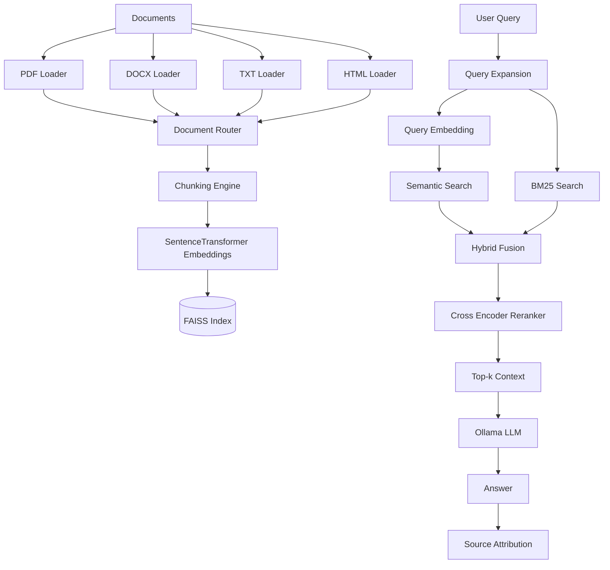

# RAGForge Architecture

```mermaid
flowchart TD

    A[Documents]

    A --> B1[PDF Loader]
    A --> B2[DOCX Loader]
    A --> B3[TXT Loader]
    A --> B4[HTML Loader]

    B1 --> C
    B2 --> C
    B3 --> C
    B4 --> C

    C[Document Router]

    C --> D[Chunking Engine]

    D --> E[SentenceTransformer Embeddings]

    E --> F[(FAISS Index)]

    Q[User Query]

    Q --> QE[Query Expansion]

    QE --> EMB[Query Embedding]

    EMB --> G[Semantic Search]

    QE --> H[BM25 Search]

    G --> I[Hybrid Fusion]
    H --> I

    I --> J[Cross Encoder Reranker]

    J --> K[Top-k Context]

    K --> L[Ollama LLM]

    L --> M[Answer]

    M --> N[Source Attribution]
```